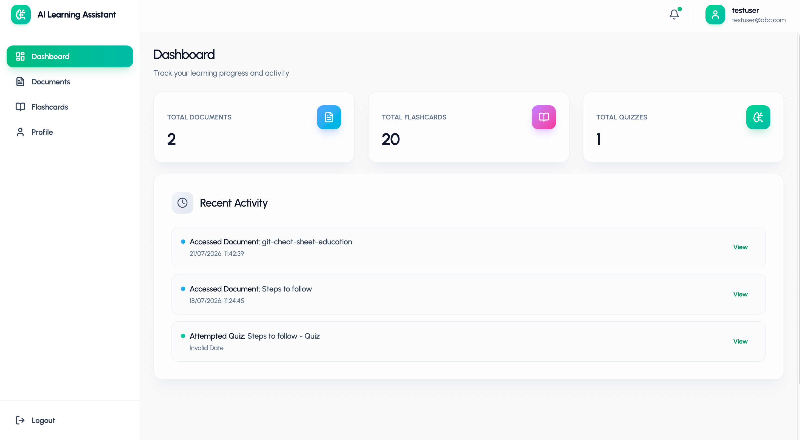
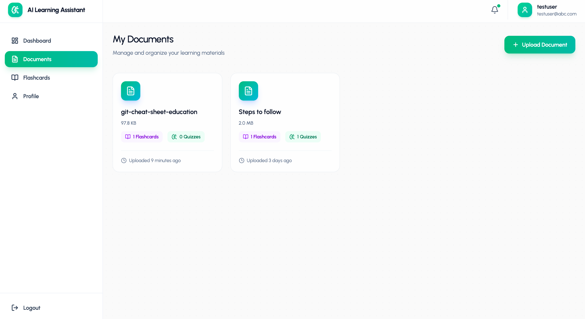
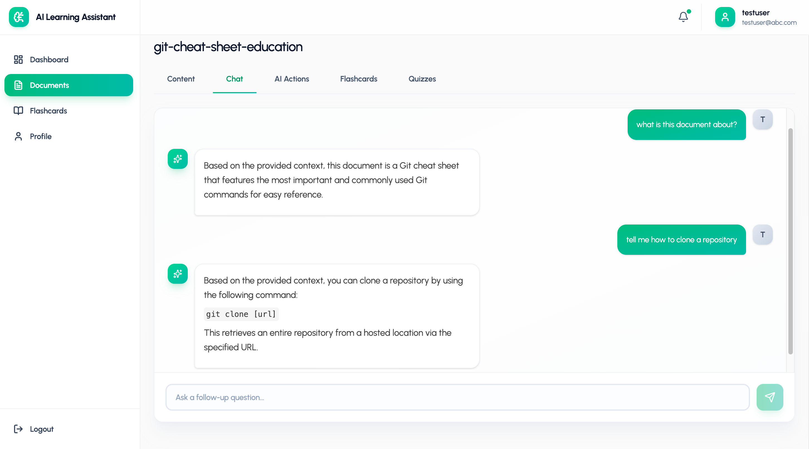
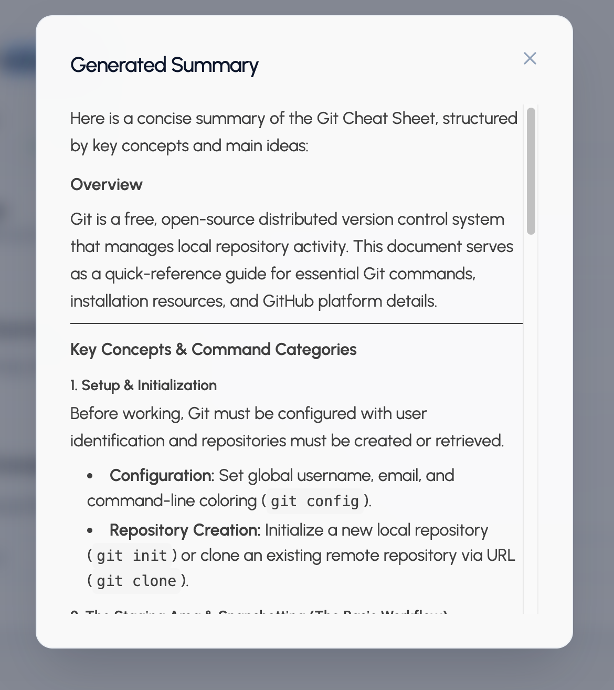
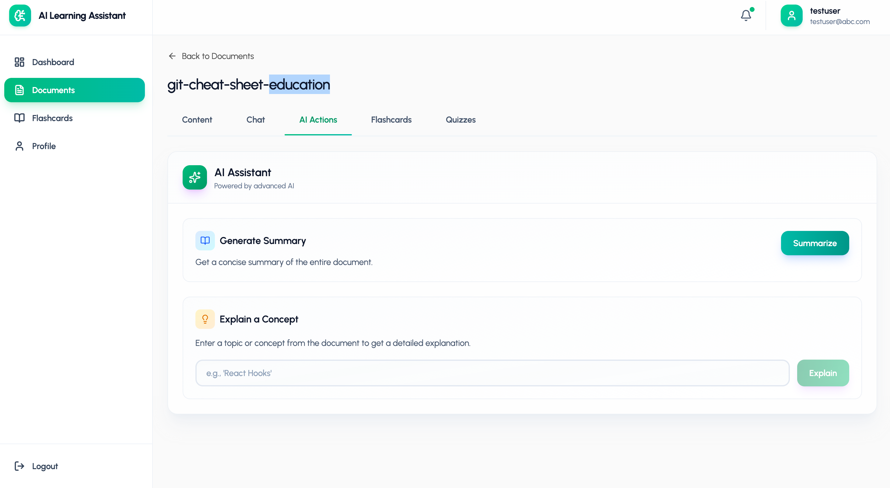
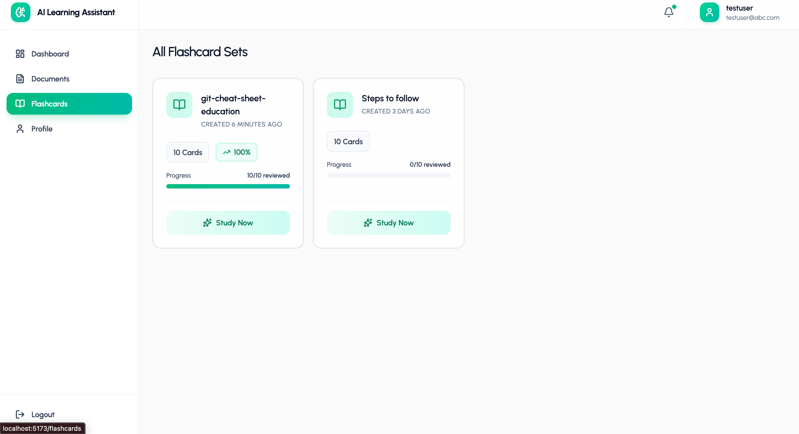
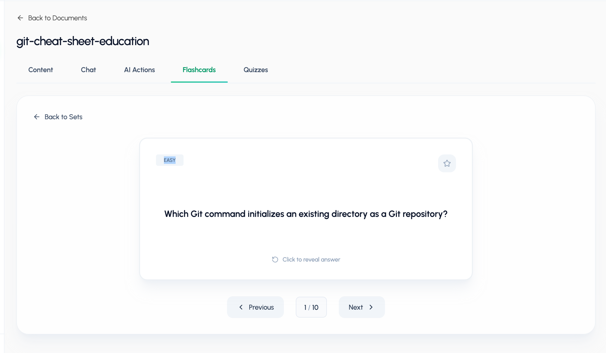
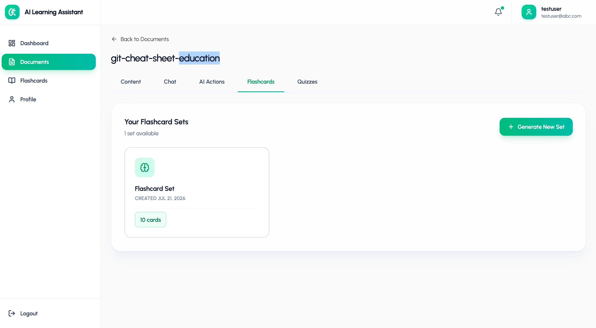
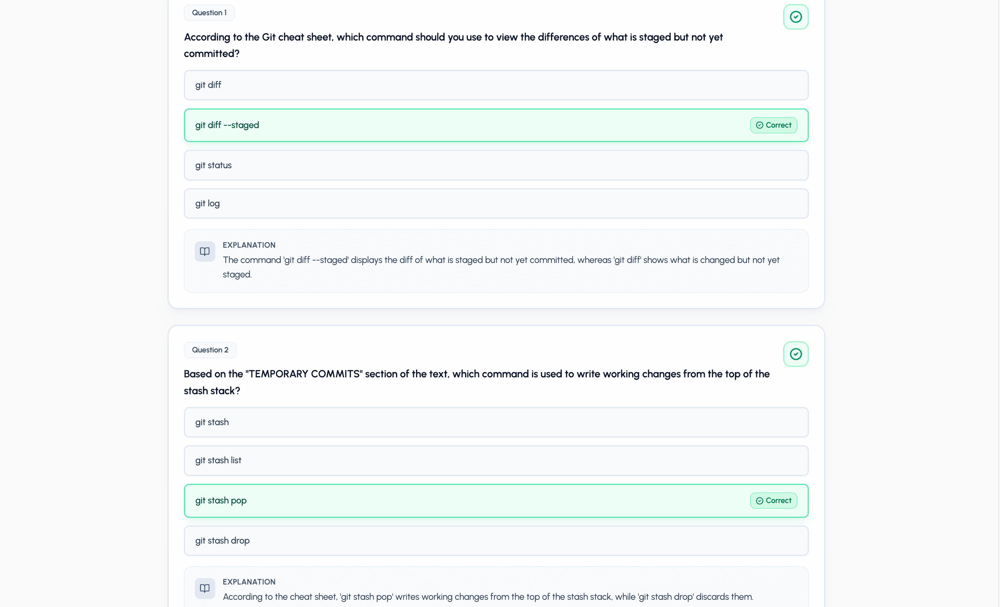
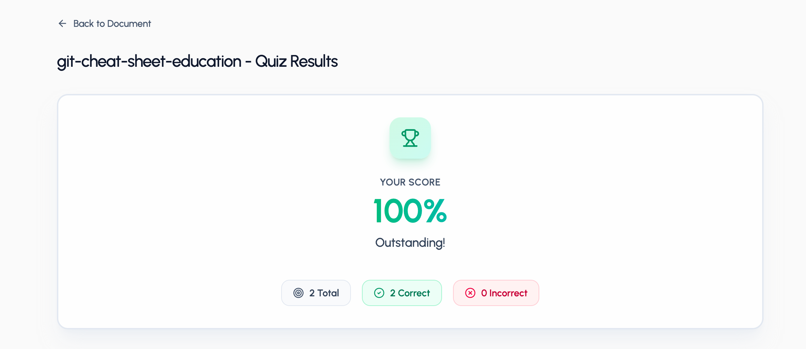

<div align="center">

# 🤖 AI Learning Assistant

### Transform Documents into Interactive Learning Experiences

Upload documents, chat with them, generate AI-powered summaries, flashcards, quizzes, and concept explanations—all in one intelligent learning platform.


---

**A full-stack MERN + Generative AI application that transforms static documents into an interactive learning experience.**

</div>

---

# 📖 Overview

AI Learning Assistant is an intelligent document-learning platform built with the **MERN Stack** and powered by **Google Gemini AI**.

Instead of reading PDFs passively, users can upload documents and interact with them through AI. The system extracts document content, stores it efficiently, and enables users to ask questions, generate summaries, create flashcards, build quizzes, and understand difficult concepts—all while tracking learning progress.

---

# ✨ Features

## 📄 Smart Document Processing

- Upload PDF documents
- Automatic text extraction
- Intelligent text chunking
- Secure document storage
- Document management dashboard

---

## 💬 AI Chat Assistant

- Ask questions about uploaded documents
- Context-aware AI responses
- Persistent conversation history
- Relevant context retrieval using document chunks

---

## 📝 AI Summary Generator

Generate concise summaries of uploaded documents instantly.

- Key concepts
- Main ideas
- Structured overview
- Easy revision notes

---

## 🧠 AI Flashcards

Automatically convert documents into interactive flashcards.

- AI-generated cards
- Difficulty levels
- Star important cards
- Track review progress
- Interactive study mode

---

## ❓ AI Quiz Generator

Create quizzes directly from documents.

- Multiple-choice questions
- Automatic scoring
- Detailed explanations
- Result tracking

---

## 💡 Concept Explainer

Enter any topic from your document and receive a detailed AI explanation.

---

## 📊 Learning Dashboard

Track your learning journey with:

- Total documents
- Flashcards created
- Quizzes attempted
- Recent activity
- Study progress

---

# 🏗️ System Architecture

```
                +----------------------+
                |    React Frontend    |
                +----------+-----------+
                           |
                     REST API Calls
                           |
                +----------v-----------+
                | Express.js Backend   |
                +----------+-----------+
                           |
        +------------------+------------------+
        |                  |                  |
        |                  |                  |
 MongoDB Database     Google Gemini AI    File Parser
        |                  |            (PDF Extraction)
        +------------------+------------------+
                           |
                  Learning Artifacts
        (Chat, Flashcards, Quizzes, Summary)
```

---

# ⚙️ Tech Stack

## Frontend

- React.js
- Vite
- JavaScript
- React Router
- Context API
- Axios

## Backend

- Node.js
- Express.js
- JWT Authentication
- Multer

## Database

- MongoDB
- Mongoose

## AI

- Google Gemini API

## File Processing

- PDF Parsing
- Text Chunking

---

# 🚀 Core Features

✔ User Authentication

✔ Document Upload

✔ AI Chat

✔ AI Summary

✔ AI Flashcards

✔ AI Quiz Generator

✔ Concept Explanation

✔ Learning Progress Tracking

✔ User Profile

---

# 📂 Project Structure

```
AI-Learning-Assistant
│
├── client
│   ├── components
│   ├── context
│   ├── pages
│   ├── services
│   └── App.jsx
│
├── server
│   ├── config
│   ├── controllers
│   ├── middleware
│   ├── models
│   ├── routes
│   ├── utils
│   └── server.js
│
└── README.md
```

---

# 📸 Screenshots

## Dashboard



---

## Documents



---

## AI Chat




---

## AI Summary




---

## AI Actions



---

## Flashcard Sets



---

## Flashcard Study Mode



---



## Quiz Generation



---



# 🔄 Application Flow

```
User
 │
 ▼
Login/Register
 │
 ▼
Upload Document
 │
 ▼
Extract Text
 │
 ▼
Chunk Document
 │
 ▼
Store in MongoDB
 │
 ▼
───────────────
│ AI Features │
───────────────
 │
 ├── Chat
 ├── Summary
 ├── Flashcards
 ├── Quiz
 └── Concept Explanation
 │
 ▼
Store Generated Results
 │
 ▼
Track Learning Progress
```

---

# 🔒 Security

- JWT Authentication
- Protected Routes
- User-scoped document access
- Secure password hashing
- Request validation

---

# 💡 Future Improvements

- Streaming AI responses
- OCR support for scanned PDFs
- Multi-document conversations
- Dark mode
- Voice assistant
- AI-generated study roadmap
- Better prompt optimization
- Learning analytics

---

# ⚙️ Installation

```bash
git clone https://github.com/yourusername/AI-Learning-Assistant.git
```

Install frontend

```bash
cd client
npm install
```

Install backend

```bash
cd server
npm install
```

Create `.env`

```env
PORT=8000

MONGO_URI=your_mongodb_connection_string

JWT_SECRET=your_secret

GEMINI_API_KEY=your_api_key
```

Run backend

```bash
npm run dev
```

Run frontend

```bash
npm run dev
```

---

# 👨‍💻 Author

**Harshad Kadam**

B.Tech CSE | MERN Stack Developer | AI Enthusiast

---

## ⭐ If you found this project useful, consider giving it a star!
